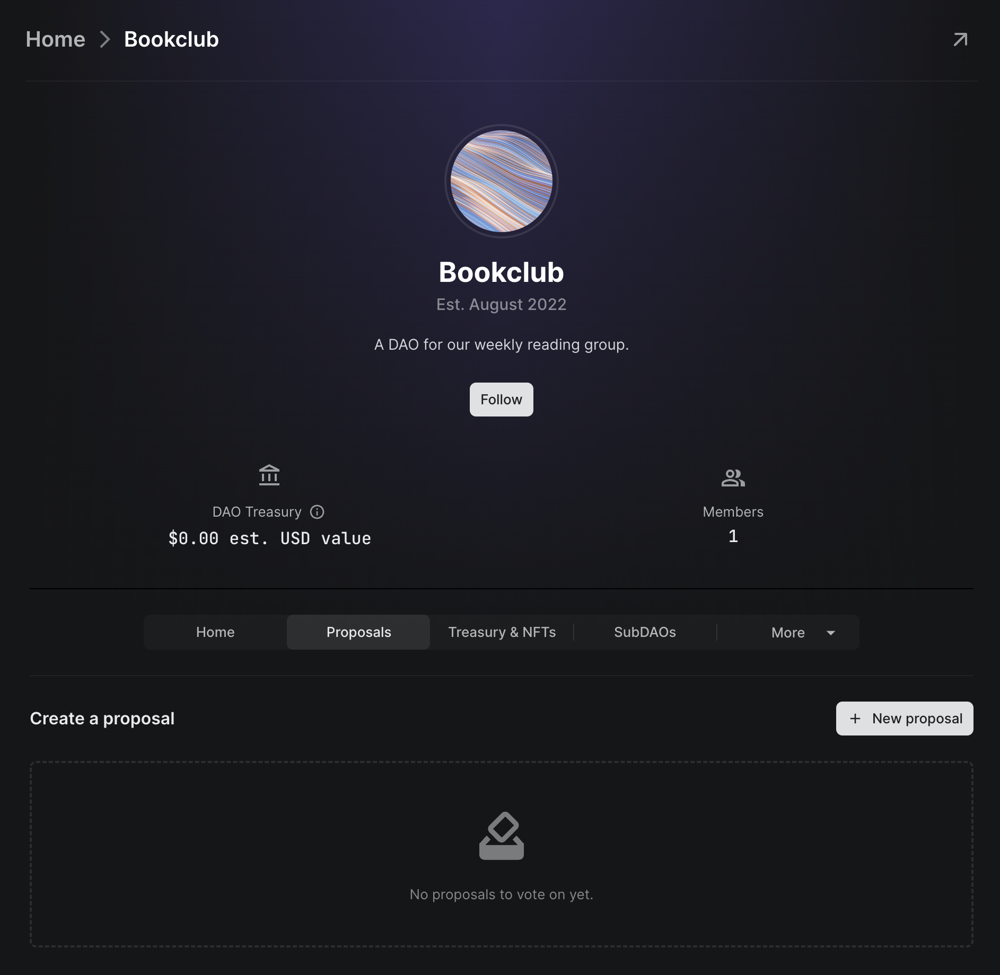
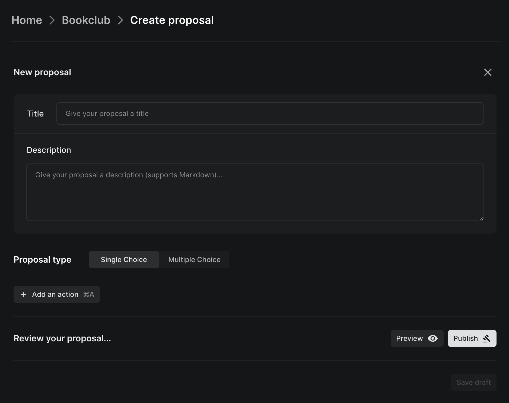
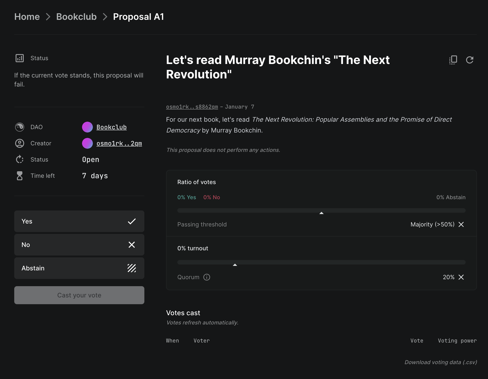

# How to create a proposal

If you don't know what a proposal is, read the [proposal explanation doc](what.md) first.


Members must join the DAO before a proposal is made in order to vote on it. Membership changes during a proposal's voting period are ignored as they only apply to future proposals.


## Steps

To begin, starting from your DAO's page, navigate to **Proposals > New Proposal**.

Then, fill in the proposal's name, description, and actions (if needed).


**What is an action?**\
[Proposal actions](what.md#actions) allow you to add rich functionality to proposals: software instructions that execute on the blockchain when a proposal is passed and executed. Read the [proposal docs](what.md) to learn more.


If you want to create a multiple choice proposal, check out the [multiple choice proposal docs](types.md#multiple-choice).

To preview how the proposal will look once its created, press **Preview**.

Once you are satisfied with the proposal, press **Publish**. Your wallet will prompt you to approve the transaction.

Once you approve it, your proposal will be live and the DAO members can vote on it!

