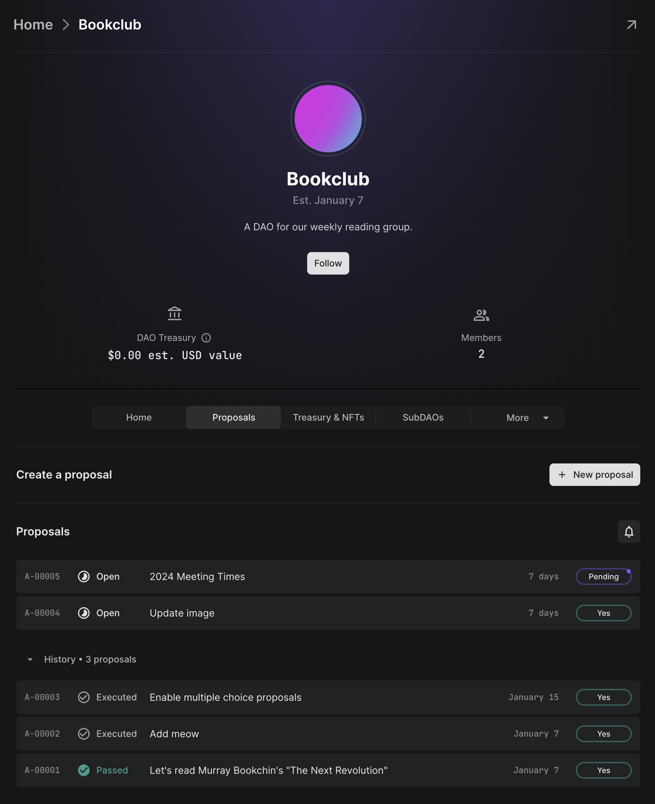
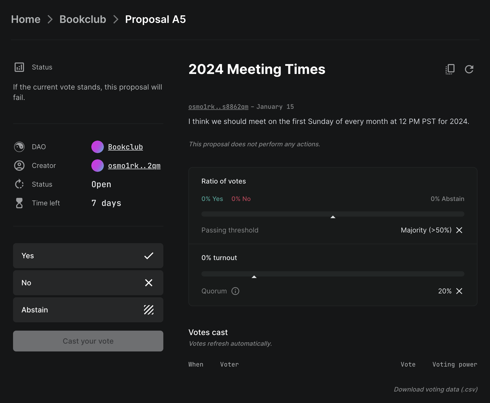
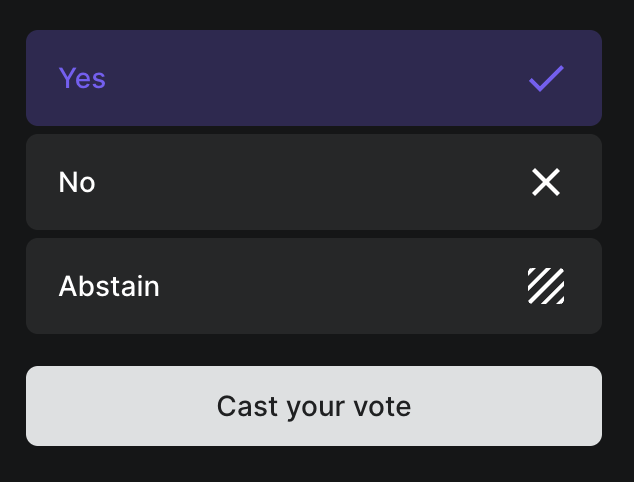
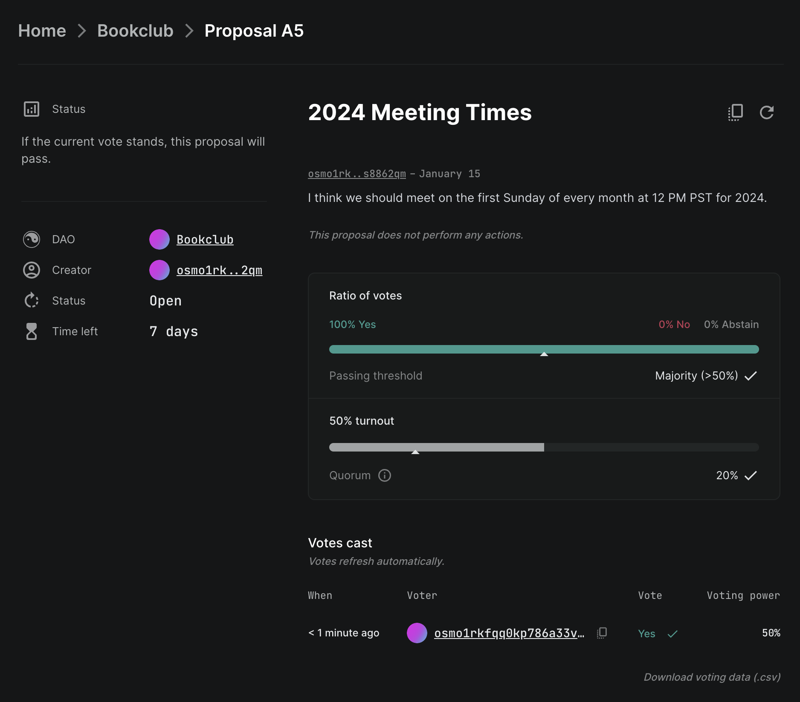

# How to vote on a proposal

Once you've [created a proposal](how-to-create-a-proposal), members of the DAO need to vote on it.

## Steps

To begin, starting from your DAO's page, navigate to the proposal from the **Proposals** tab.

Then, click on the proposal you want to vote on in the list.

Click on the desired vote option on the left side of the page.

Click on the **Cast your vote** button to submit your vote. Approve the transaction in your wallet to confirm submission.

The proposal will be updated with your vote. If your vote was sufficient to pass or fail the proposal, it will now be complete. Since this proposal's outcome has not yet been determined, it is still open for voting.
