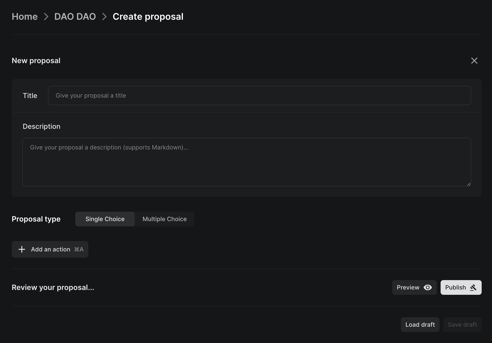
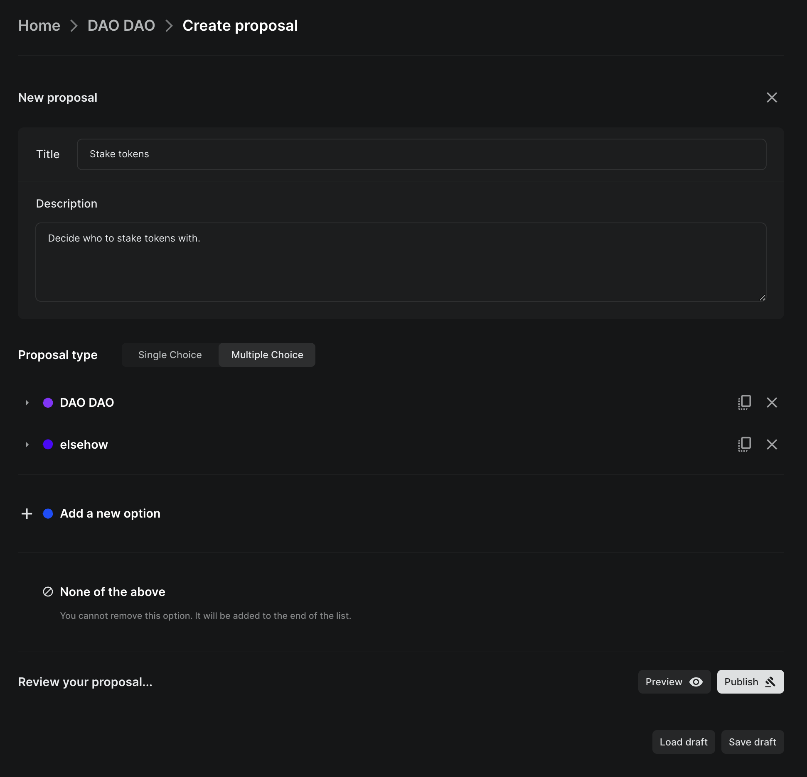
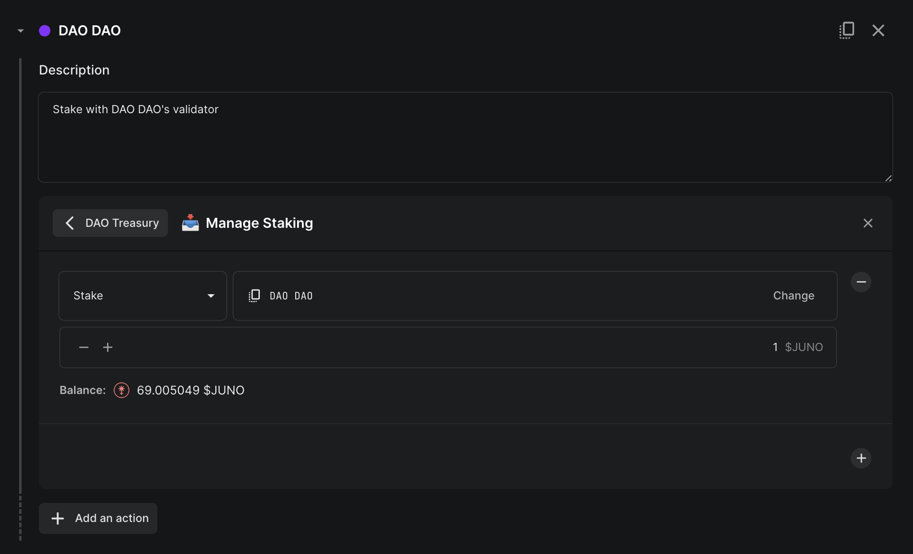
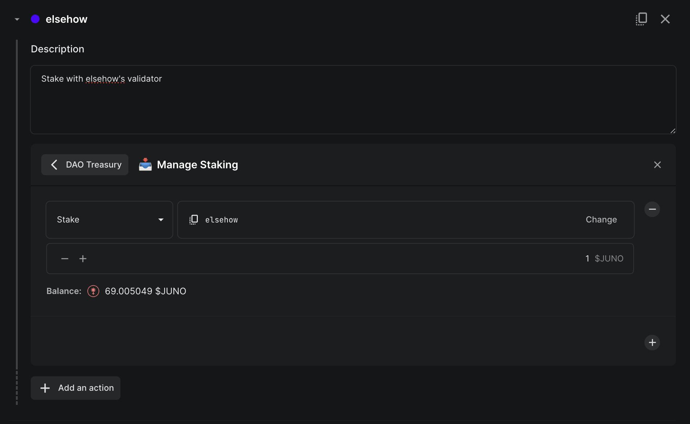
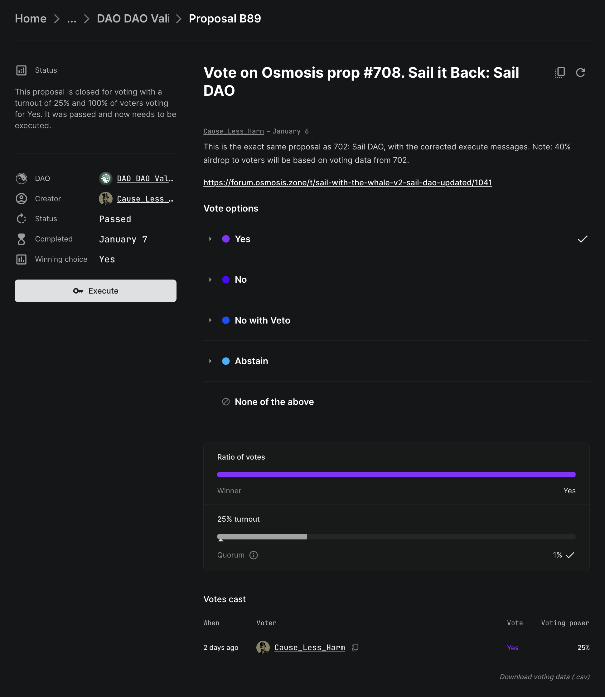
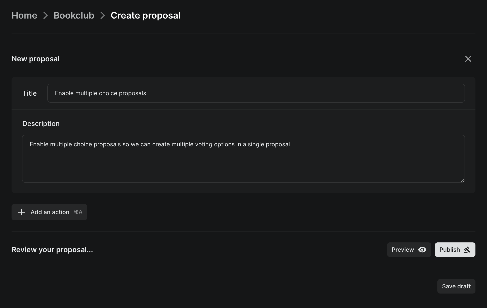
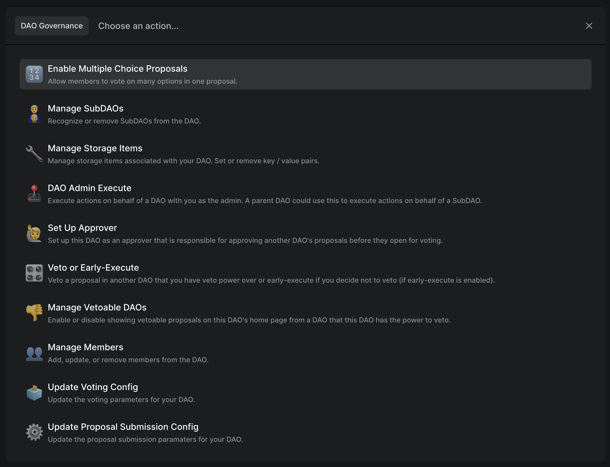
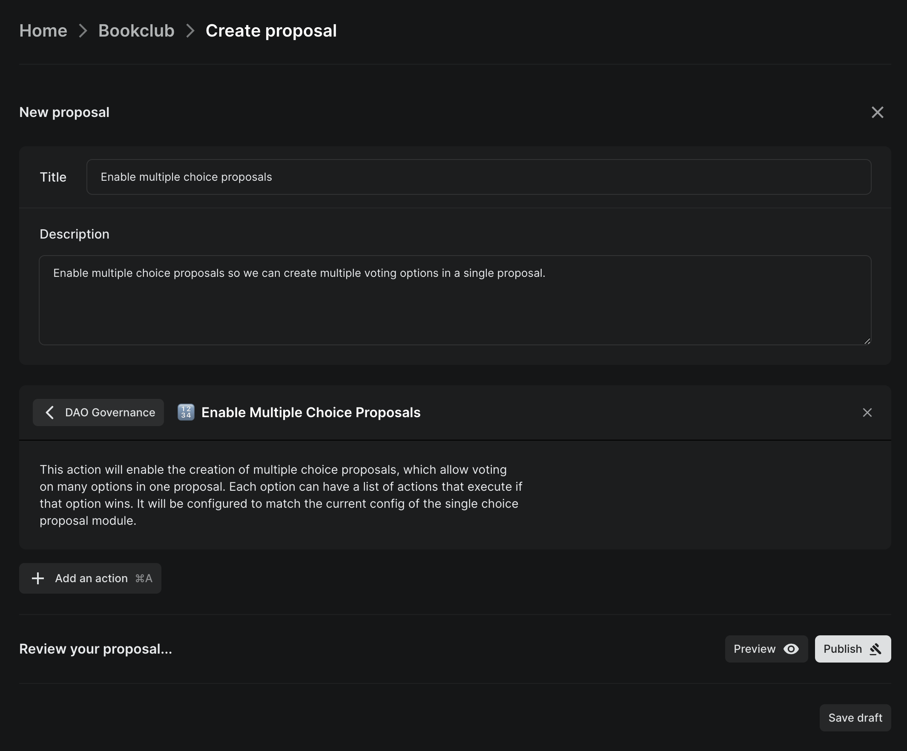

# Types of proposals

DAO DAO supports single choice (`Yes`, `No`, or `Abstain`) and multiple choice (`A`, `B`, `C`, `D`, ..., or `None of the above`) proposals. They work very similarly.

## Single choice

A single choice proposal contains a title, description, and an optional set of actions to execute if passed. The only voting options are `Yes`, `No`, and `Abstain`, and thus a single choice proposal either passes or fails.

### Title

A title identifies the purpose of a proposal. It should be concise.

### Description

A description explains in detail what a proposal _is_. This may be a [constitution](https://daodao.zone/dao/juno10h0hc64jv006rr8qy0zhlu4jsxct8qwa0vtaleayh0ujz0zynf2s2r7v8q/proposals/A1), legal agreement, justification, or simply a place to document relevant information. Really it can be anything you want. There are no rules, and you should feel free to experiment.

For example, if you are submitting a proposal to pay someone's salary, you may want to explain why you're paying them or what the relevant terms of work are.

You can use [Markdown syntax](https://www.markdownguide.org/basic-syntax) for rich formatting.

### Actions

Actions execute when a proposal is passed and executed. These actions let you do things like spend from the DAO's treasury, add or remove members, mint new governance tokens, and more.

DAO DAO already has many actions that cover almost every possible action you can take on a blockchain. For the most part, you can create proposals without needing to actually write out any software instructions (i.e. transactions) by hand. The DAO DAO UI abstracts away many of those details for you. If you're doing something custom or experimental, you can always use a custom message. If you'd like to create a new action for DAOs to use, [you can do that too](https://github.com/DA0-DA0/dao-dao-ui/wiki/Adding-an-action-to-DAO-DAO)!

## Multiple choice

Multiple choice proposals can contain between 2 and 20 different options, each with their own set of actions, and they always include a `None of the above` option to ensure a proposal cannot force an action to be taken.

If your DAO does not have multiple choice proposals enabled, ensure the DAO is\
at least on V2, and then [enable multiple choice proposals with a single choice\
proposal](types.md#enable-multiple-choice-proposals).

### How do they work?

A multiple choice proposal is just like a single choice proposal, except that instead of a single set of actions, you can create many labeled options, each with their own set of actions.

Simply choose the `Multiple Choice` proposal type when creating a new proposal.

Each option has different actions associated with it.

When you go to vote, the proposal will show each of the options and a `None of the above` option, instead of just `Yes` and `No`.

### Enable multiple choice proposals

If you create a new DAO, multiple choice proposals are enabled by default. If you have an existing DAO without multiple choice proposals enabled, you can enable them by [passing a single choice proposal](how-to-create-a-proposal) containing the `Enable Multiple Choice Proposals` action in the `DAO Governance` category.

On the proposal creation page, click the `Add an action` button.

Click on the `DAO Governance` category, and then choose `Enable Multiple Choice Proposals`.

Once you publish, pass, and execute this proposal, multiple choice proposals will be enabled for the DAO!
