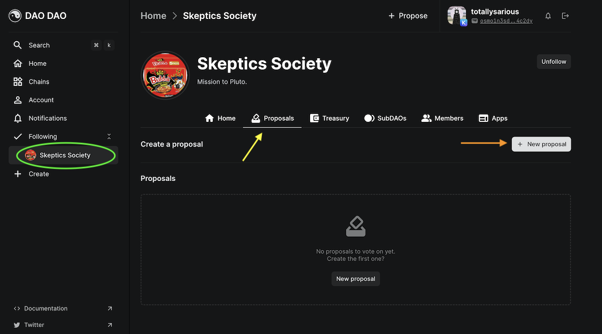
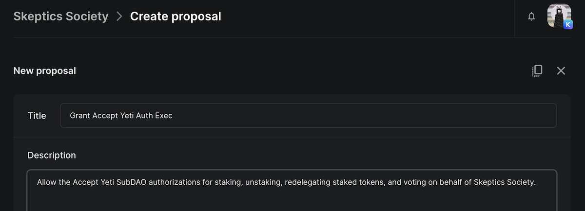
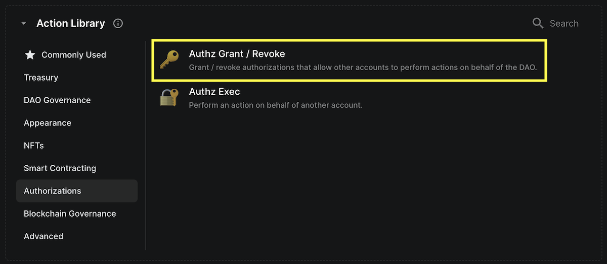
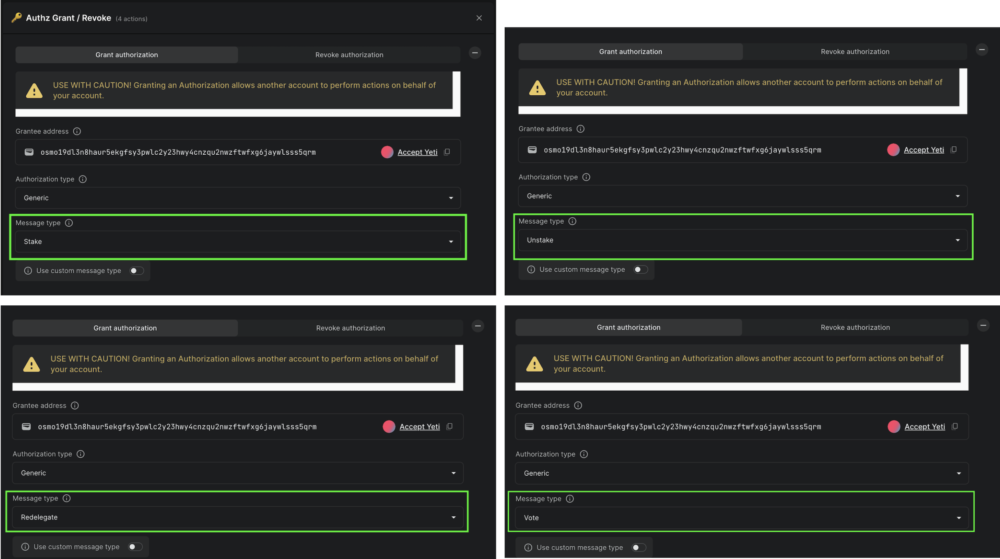

# Grant Authorization

You can grant any account, like a wallet, another DAO, or SubDAO, authorization to perform a number of actions on behalf of the DAO. While this is a very powerful feature, it is worth understanding the authz module's [critical limitation](limitation.md) before dreaming about all of the authorization flows you want to create. In time, we hope this is resolved by the maintainers of the SDK.

## 1. Create Proposal

a. From your DAO page, example circled in green, click the Proposal tab, indicated by the yellow arrow.

<figure><figcaption></figcaption></figure>

b. Create a new proposal by clicking the +Proposal button.

c. Give your proposal a title and description.

<figure><figcaption></figcaption></figure>

## 2. Add Actions

a. Scroll down to the Action section of the Create proposal page. Select Authz Grant / Revoke from the Authorizations tab.

<figure><figcaption></figcaption></figure>

b. Since the proposal in this example seeks to give a SubDAO authorization to stake, unstake, redelegate and vote on behalf of the DAO, four sepearate actions will need to be added to the proposal.

c. Under Grantee address, paste an Osmosis address or search for an account or DAO already on DAO DAO. This will be the party granted Authz Exec privileges.

d. In this example the Authorization type is "Generic" and the Message types are "Stake," "Unstake," "Redelegate," and "Vote."

<figure><figcaption></figcaption></figure>

e. At the bottom of the screen will be an option to publish your proposal. Once you have reviewed your changes, publish your proposal to start the vote!

## 3. Vote

a. Once the proposal is live, you and other DAO members can vote. [Learn more about voting here!](../../dao-governance/proposals/how-to-vote-on-a-proposal.md)

b. If the DAO membership votes in favor of granting authz exec priveleges, the change will happen automatically once the proposal has been executed.
