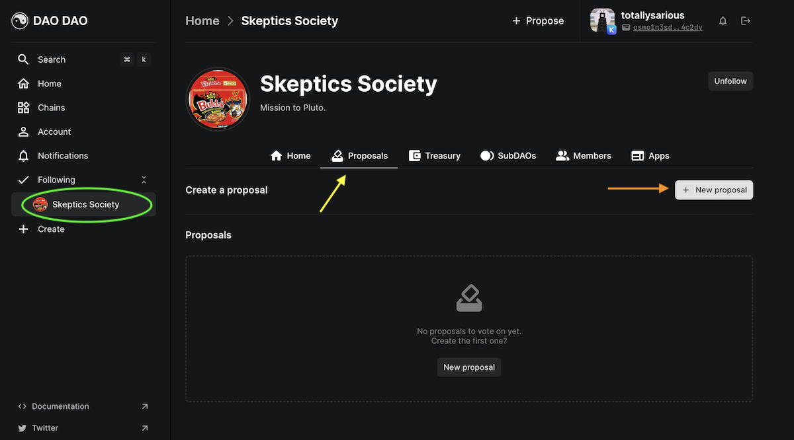
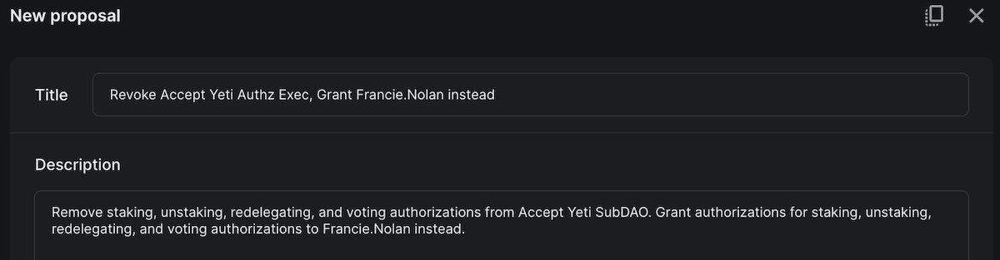
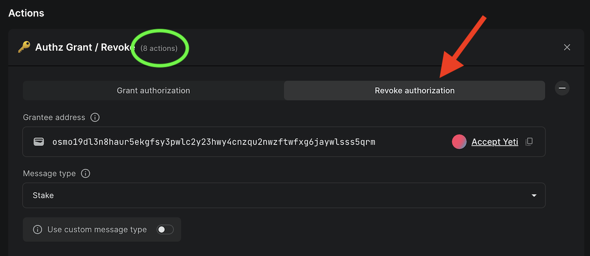

# Revoke Authorization

You can revoke any authorized priveleges via a DAO governance proposal.

## 1. Create Proposal

a. From your DAO page, example circled in green, click the Proposal tab, indicated by the yellow arrow.

<figure><figcaption></figcaption></figure>

b. Create a new proposal by clicking the +Proposal button.

c. Give your proposal a title and description.

<figure><figcaption></figcaption></figure>

## 2. Add Actions

a. Scroll down to the Action section of the Create proposal page. Select Authz Grant / Revoke from the Authorizations tab.

<figure><figcaption></figcaption></figure>

b. Select the Revoke authorization tab, indicated by a red arrow in the image below.

<figure><figcaption></figcaption></figure>

c. Under Grantee address, paste an Osmosis address or search for an account or DAO already on DAO DAO. This will be the party having Authz Exec privileges revoked.


In this example, the DAO is revoking authrizations to stake, unstake, redelegate and vote. They are also granting these same authorizations to an individual account in the same proposal. This means the proposal has a total of eight actions, indicated with the green circle in the image above.


d. At the bottom of the screen will be an option to publish your proposal. Once you have reviewed your changes, publish your proposal to start the vote!

## 3. Vote

a. Once the proposal is live, you and other DAO members can vote. [Learn more about voting here!](../../dao-governance/proposals/how-to-vote-on-a-proposal)

b. If the DAO membership votes in favor of the proposal, all of the change will happen automatically at the close of the voting period.
