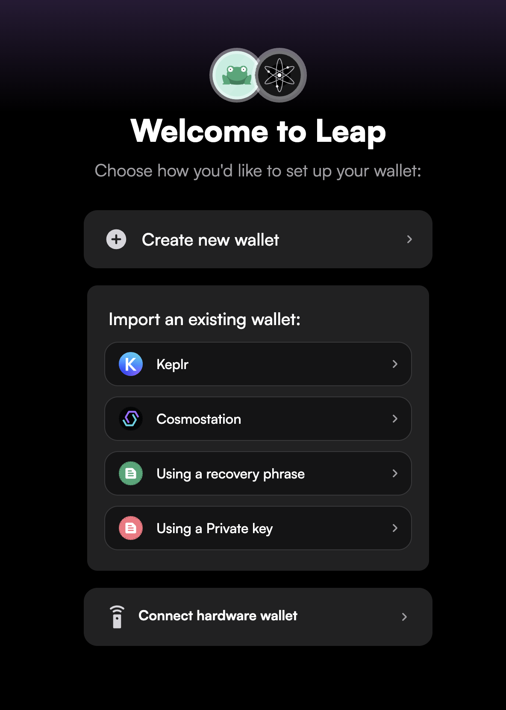
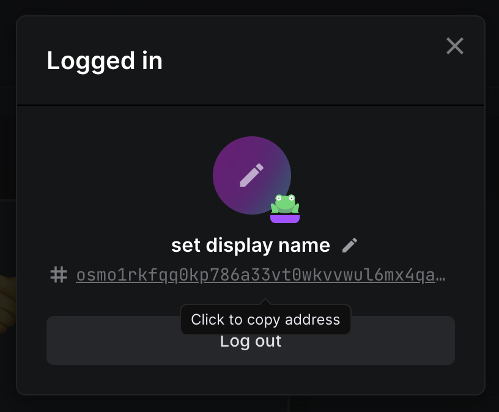
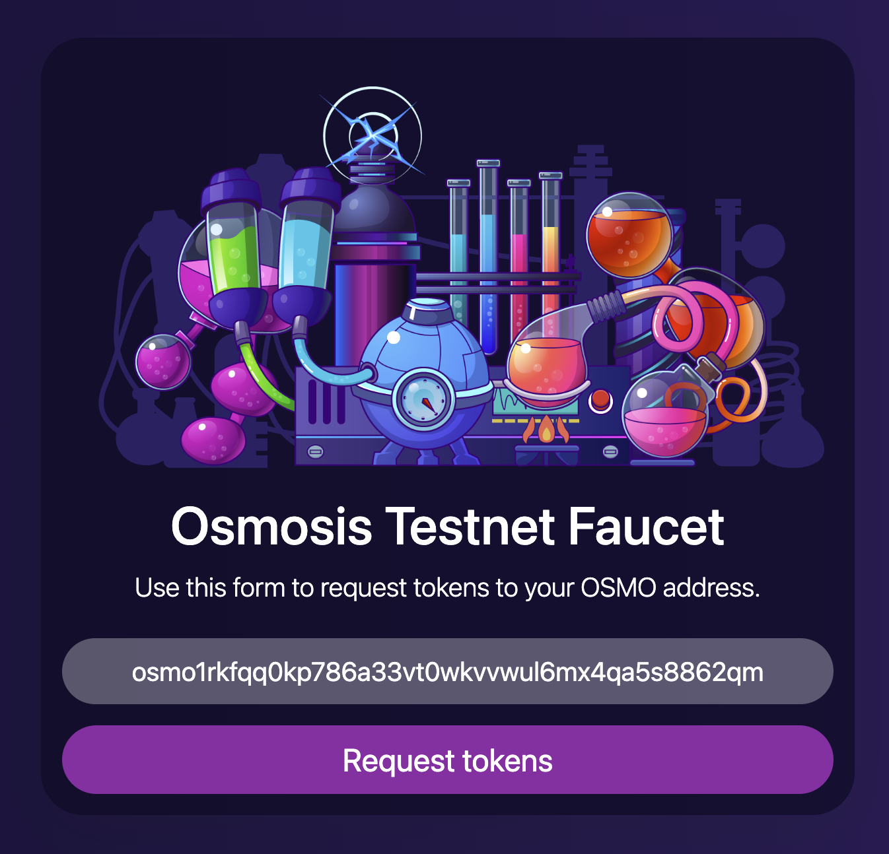
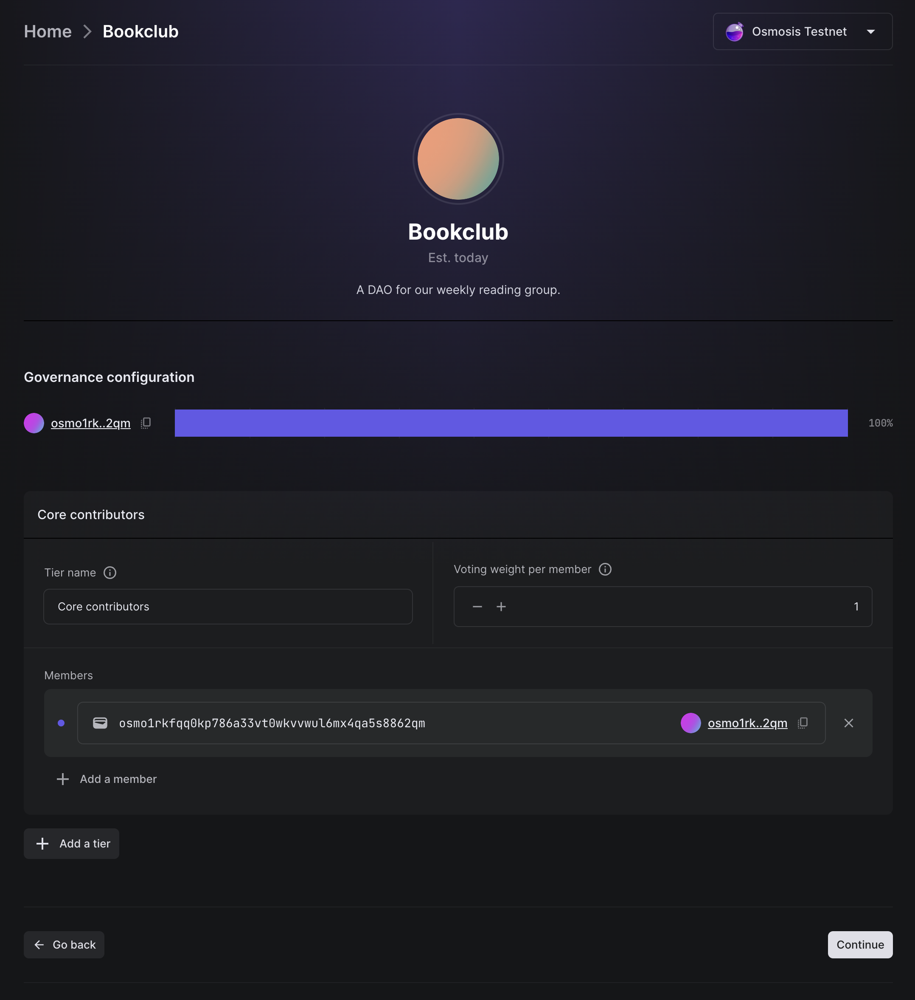
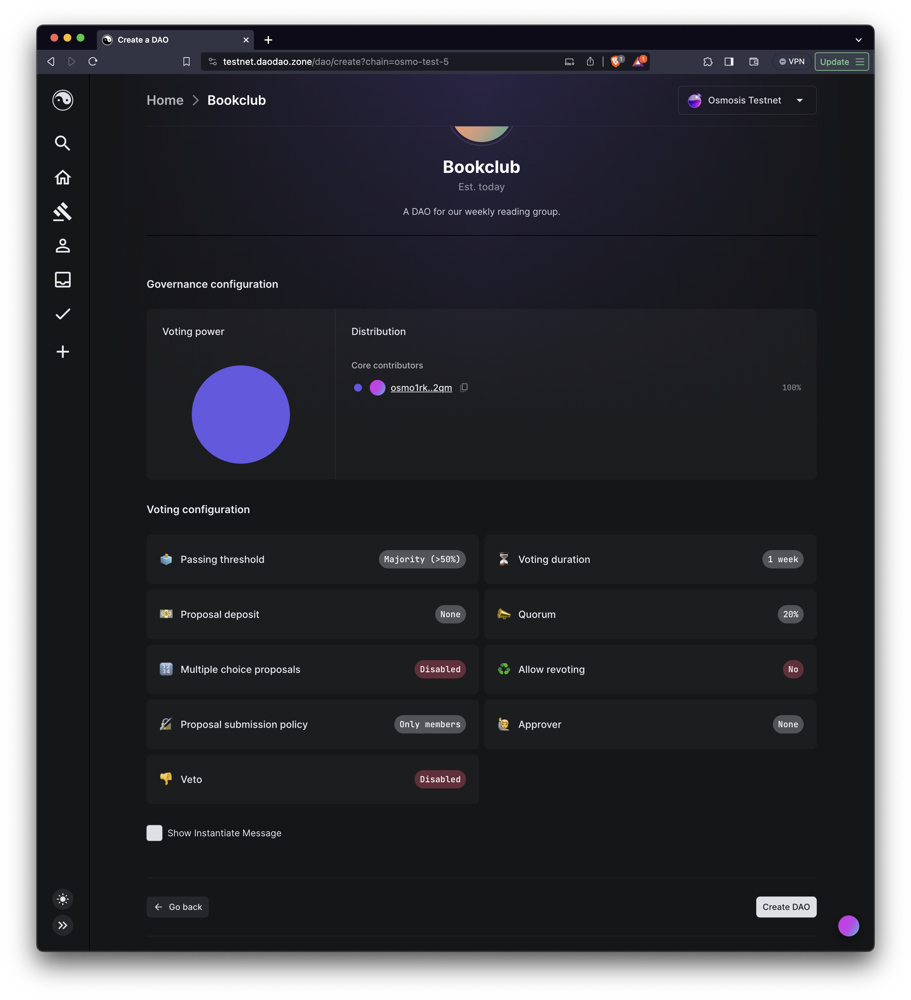
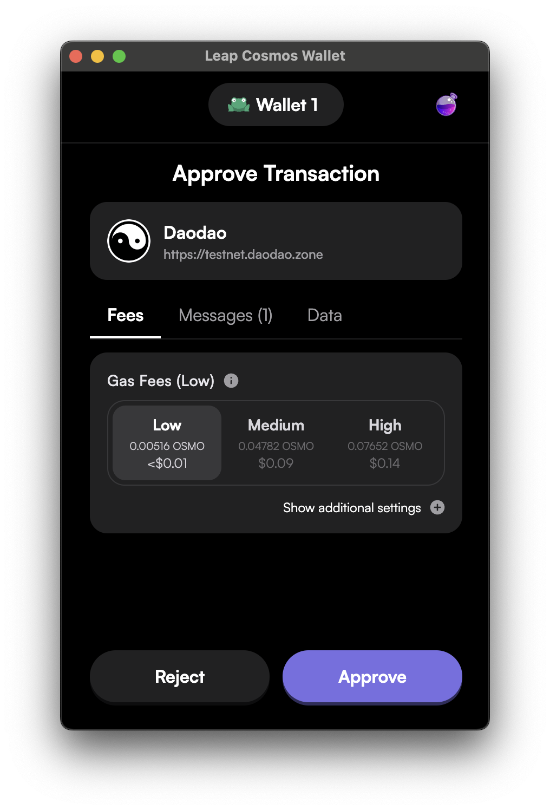

# Create your first DAO

For this tutorial, **we'll make a DAO for your reading group**. This will let folks in your reading group vote on which books to read, organize money for snacks, and so on.

To keep things cheap, we'll do everything on the Osmosis testnet. Testnet tokens ($OSMO) have no value, and you can get some for free. More on that in a moment.

## Install Leap

To use DAO DAO you'll need a wallet. A wallet is your digital identity on a blockchain. There are many options, but a good choice is the [Leap wallet](https://www.leapwallet.io). You'll need to install that on your phone or browser before getting started.

Once you've installed Leap, you need to create an account. To do this, open the Leap extension by pressing the puzzle piece icon in the top right of your browser and clicking on the Leap wallet extension.

Once you do that, you'll be directed to a page where you can create a new account.

Make sure to store your seed phrase somewhere only you'll be able to find it. This is the recovery key in case you ever need to recover your account, like if you lose your device.

## Connect your wallet

To make your first DAO, head to [testnet.daodao.zone](https://testnet.daodao.zone/) and connect your wallet by pressing the `Log in` button.

Once logged in, you will see your Osmosis testnet address. Click on it to copy and save it for the next step.

## Get some testnet $OSMO

To get some testnet $OSMO, head over to [faucet.testnet.osmosis.zone](https://faucet.testnet.osmosis.zone) and paste your Osmosis address into the form. A bot should send you enough $OSMO to follow this tutorial.


We'll stick to the testnet for this tutorial, but once you're ready to build a real DAO, you'll need some mainnet tokens on any of the chains supported by DAO DAO. (The [mainnet version of DAO DAO](https://daodao.zone) is deployed on a handful of chains, including Osmosis mainnet). You can get $OSMO on some centralized exchanges, such as [Kraken](https://kraken.com), or on a decentralized exchange if you already have cryptocurrencies in the Cosmos ecosystem, like [Osmosis' DEX](https://osmosis.zone).


## Create a DAO

Navigate to the DAO creation page [on testnet](https://testnet.daodao.zone/dao/create?chain=osmo-test-5) (or [on mainnet](https://daodao.zone/dao/create), if that's your thing).

## Name and describe your DAO

Every DAO has a name and a description. These will be displayed in the DAO DAO UI and should communicate the purpose of the DAO to the world.

Let's create a DAO called `Bookclub`. We'll make our DAO member-based for simplicity.


To learn more about the differences between member- and token-based DAOs, read our documentation [here](../introduction/whats-a-dao/#voting-power).


## Add the initial members

Now we can add the initial members of our DAO. If you're making this DAO with friends, add their Osmosis addresses during this step. Otherwise, you can start the DAO with only yourself and add new members via proposals later.

### Create DAO

On the next screen, there are many configuration options available that determine how the DAO behaves. You can [read about the available voting configuration options](../dao-governance/configuration/voting/) if you like, but for now, we'll accept the defaults and create our DAO!

Go ahead and press `Create DAO` in the bottom right. If you see an error here, make sure you have some $OSMO in your testnet wallet.

Your wallet will ask you to approve the transaction. Approve it.

🎉 **Congratulations!** You've made a DAO! 🎉

