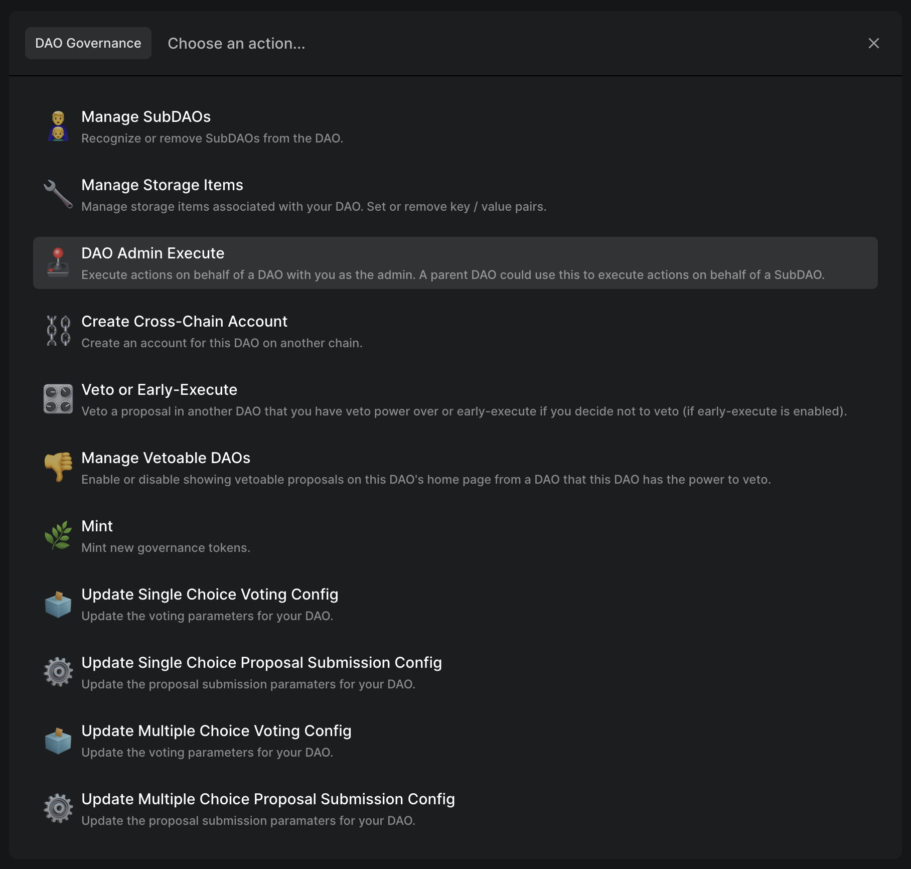
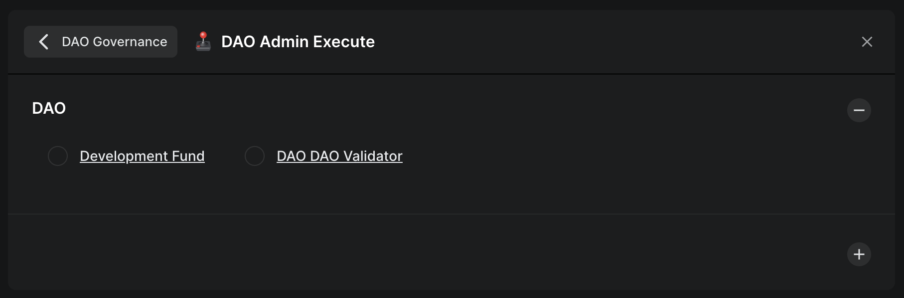
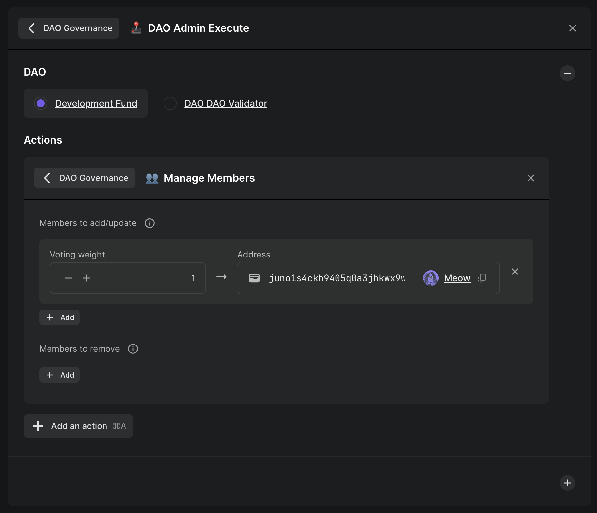

# How to act on behalf of a SubDAO

As discussed in [What are SubDAOs?](what), the admin (or parent DAO) can execute any action on behalf of the SubDAO. Follow this guide or [watch our video guide](https://youtu.be/T8P8TFOU_kU) to learn how.

In the parent DAO, create a new proposal and add the `DAO Admin Execute` action from the `DAO Governance` category.

Then, select the SubDAO you want to act on behalf of.

Then simply choose the action(s) you want to execute!

Once you pass and execute the proposal, your action(s) will be executed on behalf of the SubDAO.
