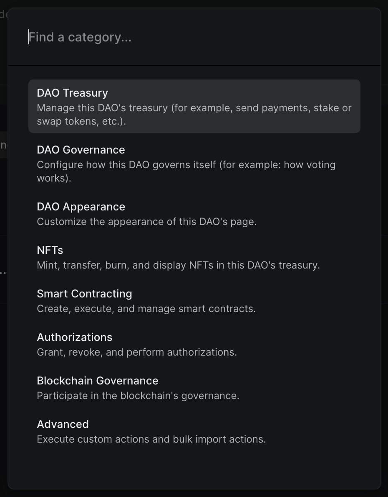
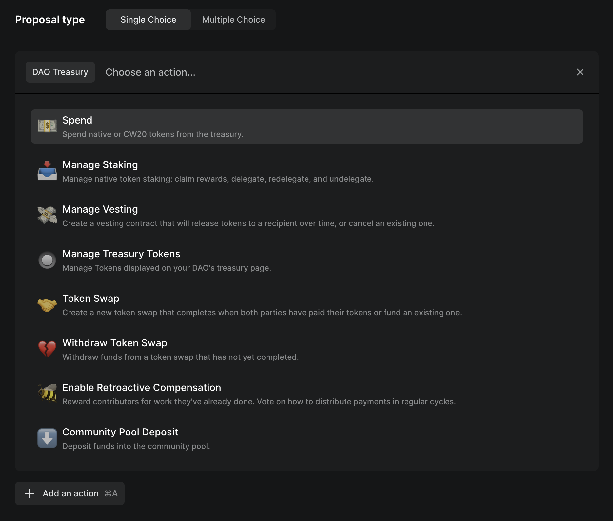
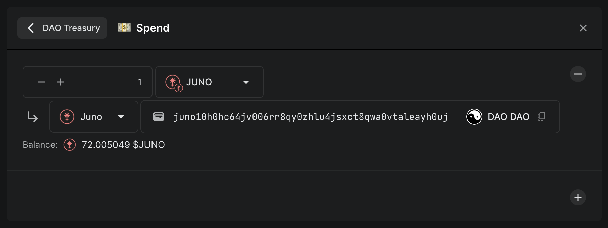
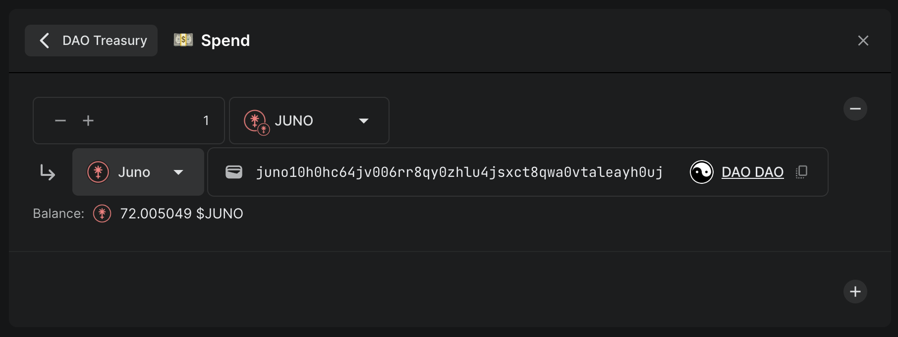
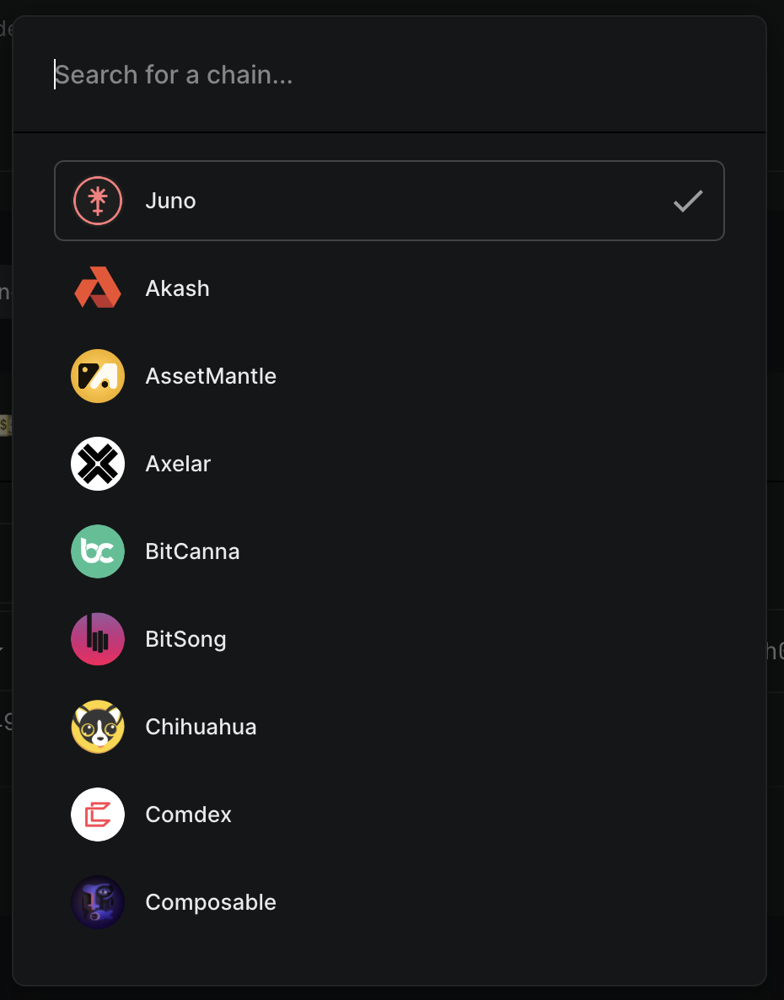
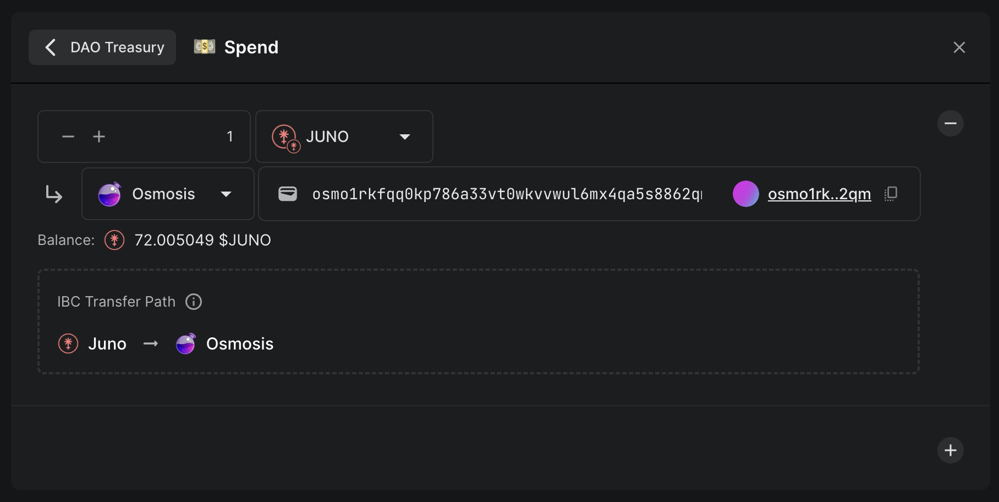

# Send tokens

Sending tokens from a DAO is easy. Tokens can be sent to a recipient on the same chain as the DAO or on another [IBC](../../introduction/whats-a-blockchain/#how-do-you-send-tokens-between-blockchains)-connected chain.

## Steps

[Create a proposal](../../dao-governance/proposals/how-to-create-a-proposal) and add the `Spend` action from the `DAO Treasury` category.

### Change recipient chain

To choose which chain the tokens should be sent to, click on the dropdown to the left of the recipient address. This can be the same chain as the DAO or any IBC-connected chain.

Simply choose which chain to send the tokens to.


Only chains that have an active IBC connection with the chain the DAO lives on can be chosen. All chains shown in the list should work, but it's always a good idea to double check with someone if you are unsure. If there is a chain missing from the list, or a chain does not appear to work, please reach out to the developers on [Discord](https://discord.daodao.zone).


Once choosing a chain, it will confirm the IBC path the tokens will be sent through.

For example, the action above will send 1 $JUNO from the DAO's Juno treasury to a wallet on Osmosis.

Once this proposal is passed and executed, the tokens will be sent.
