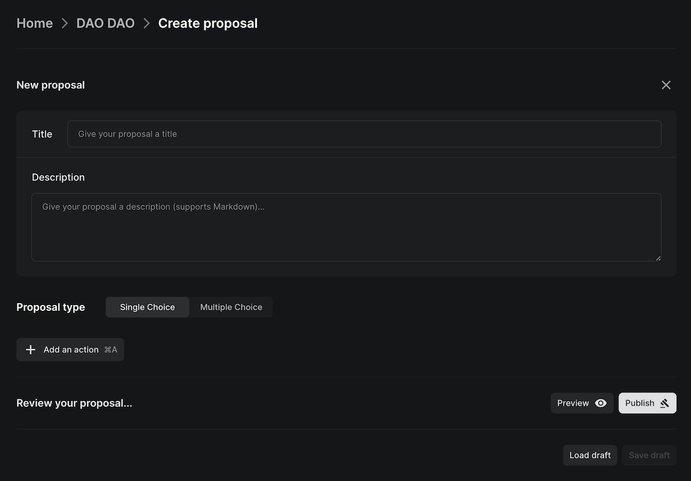
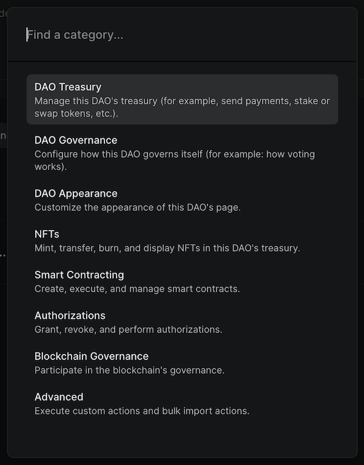
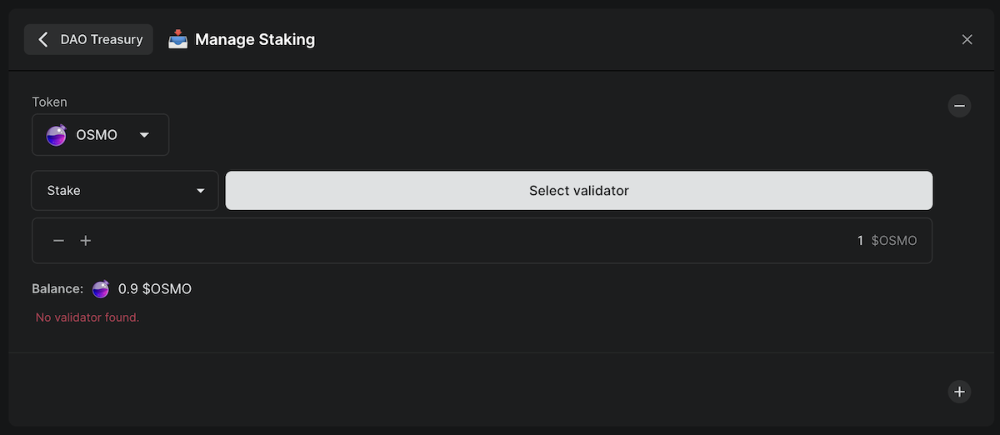
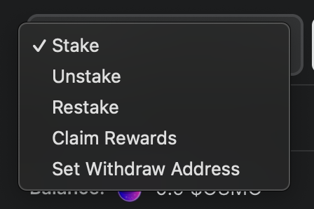

# Manage staking

You can stake tokens on the DAO's home chain and any chain that the DAO has created a [cross-chain account](./cross-chain) on.

Check out our YouTube for videos for [managing staking](https://youtu.be/DQzT3T_tPF8), [claiming rewards](https://youtu.be/SLJTuZMra7c), [redelegating](https://youtu.be/Jvx6Cd48EZw), or [unstaking](https://youtu.be/NToj_x_fid8)

## Steps

[Create a proposal](../../dao-governance/proposals/how-to-create-a-proposal) and add the `Manage Staking` action from the `DAO Treasury` category.

You can choose any token native to the chains the DAO has accounts on. If you want to stake tokens on a chain that the DAO does not have an account on, you have to [create a cross-chain account](./cross-chain) on that chain first.

Once this proposal is passed and executed, the tokens will be staked.

## Other staking options

Aside from staking, you can also unstake, restake, claim rewards, and change the rewards withdrawal address.

### Changing the rewards withdrawal address

You can change the rewards withdrawal address to a wallet or DAO other than the DAO itself. This may be useful if you have a SubDAO that you want to receive staking rewards instead.
