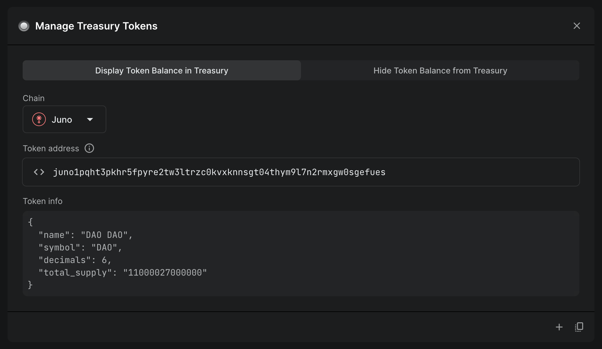
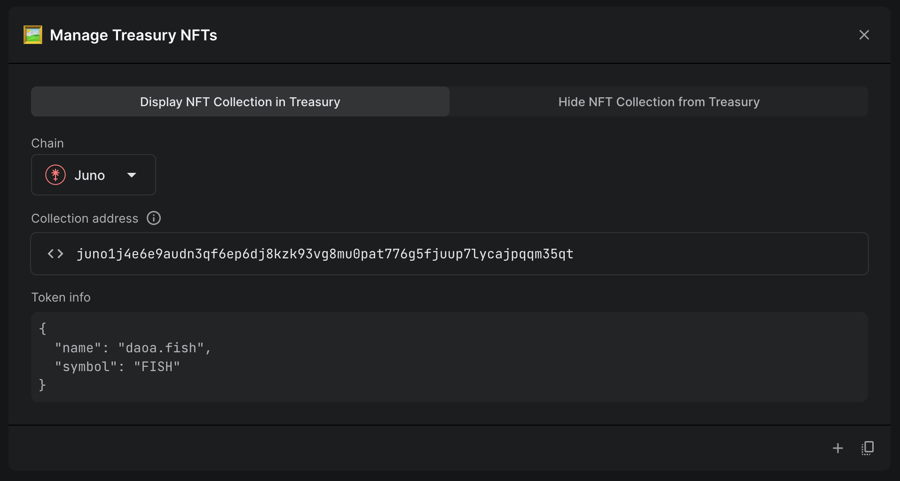

# Displaying tokens and NFTs

In DAOs, some tokens are automatically displayed in the DAO's treasury, while
others are not.

### Automatically displayed tokens

- The native gas/fee token of the chain and any cross-chain accounts the DAO
  controls.
- Tokens created via token factory (and thus live in the native bank module of
  the chain).
- Tokens transferred over IBC from another chain.

### Manually added tokens

- [CW20 (smart
  contract)](https://github.com/CosmWasm/cw-plus/blob/main/packages/cw20/README.md)
  tokens
- [CW721 (smart
  contract)](https://github.com/public-awesome/cw-nfts/blob/main/packages/cw721/README.md)
  NFTs

CW20 tokens were the first dynamic tokens supported in the Cosmos, before the
[x/tokenfactory](https://docs.osmosis.zone/osmosis-core/modules/tokenfactory/)
SDK module was built to enable creating custom tokens without smart contracts.

CW721 NFTs are the base for pretty much all smart-contract-based NFTs in the
Cosmos ecosystem.

Since both of these token standards are smart contracts that any protocol or
platform can deploy, there is no centralized index of their balances. DAOs must
register them manually so the UI knows they exist.

## How to display in the treasury

You can display CW20 tokens and CW721 NFTs in the DAO's treasury with a simple
action in a proposal.

Find the `Manage Treasury Tokens` action in the `Treasury` category of the
action library, and the `Manage Treasury NFTs` action in the `NFTs` category.

Simply choose the chain (if the token/NFT lives in one of the DAO's [cross-chain
accounts](./cross-chain)) and enter the contract address of the token/NFT you
want displayed, and the treasury will know to display it once you pass and
execute the proposal.

### Troubleshooting

This display feature is necessary due to the nature of CW20 and CW721 tokens,
while also serving to reduce spam. Regardless of whether a token or NFT is
displayed in the treasury, if it was transferred to the DAO's address, the
tokens are owned by the DAO.

If you sent a token/NFT to the treasury and registered it for display, but it's
not showing up, it may be an indexer or other issue. Contact us if you've
successfully registered a token/NFT for display according to the guide above and
still can't see it.
