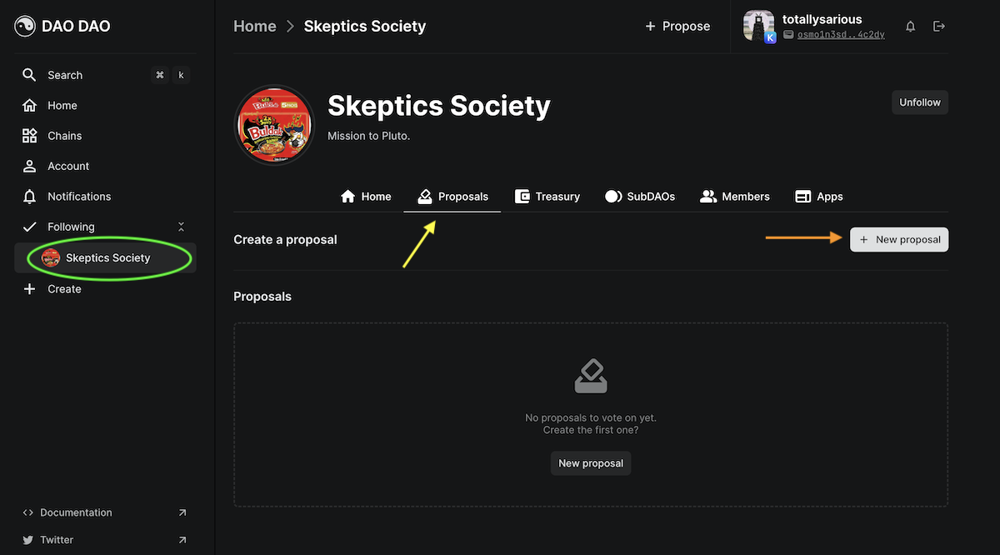
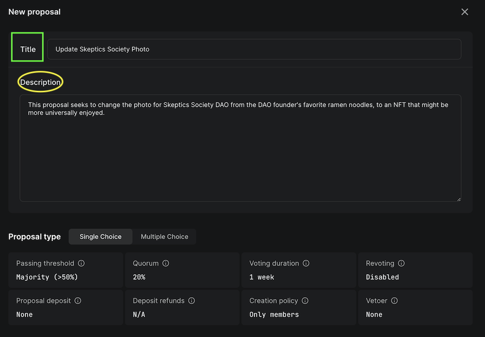
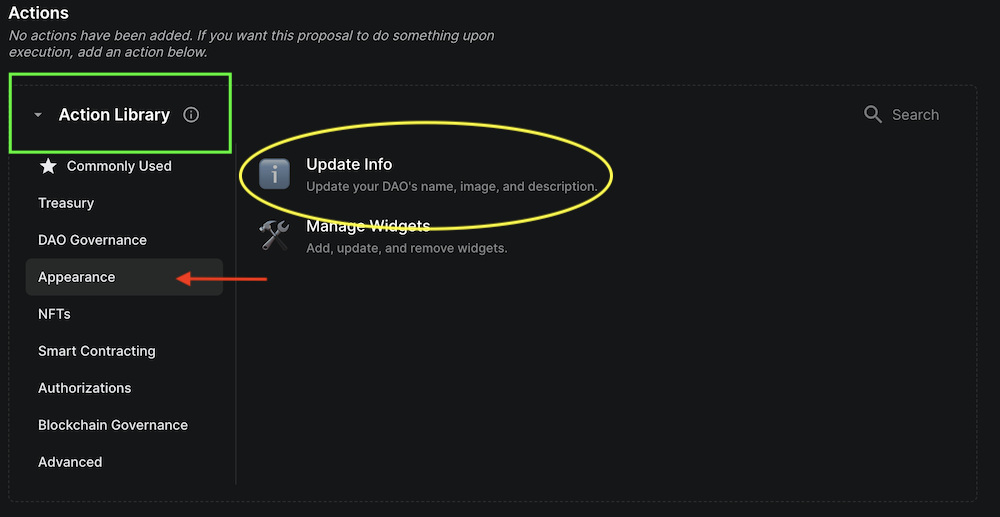
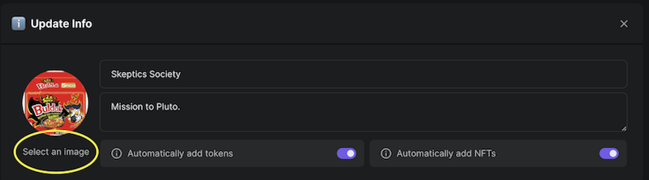
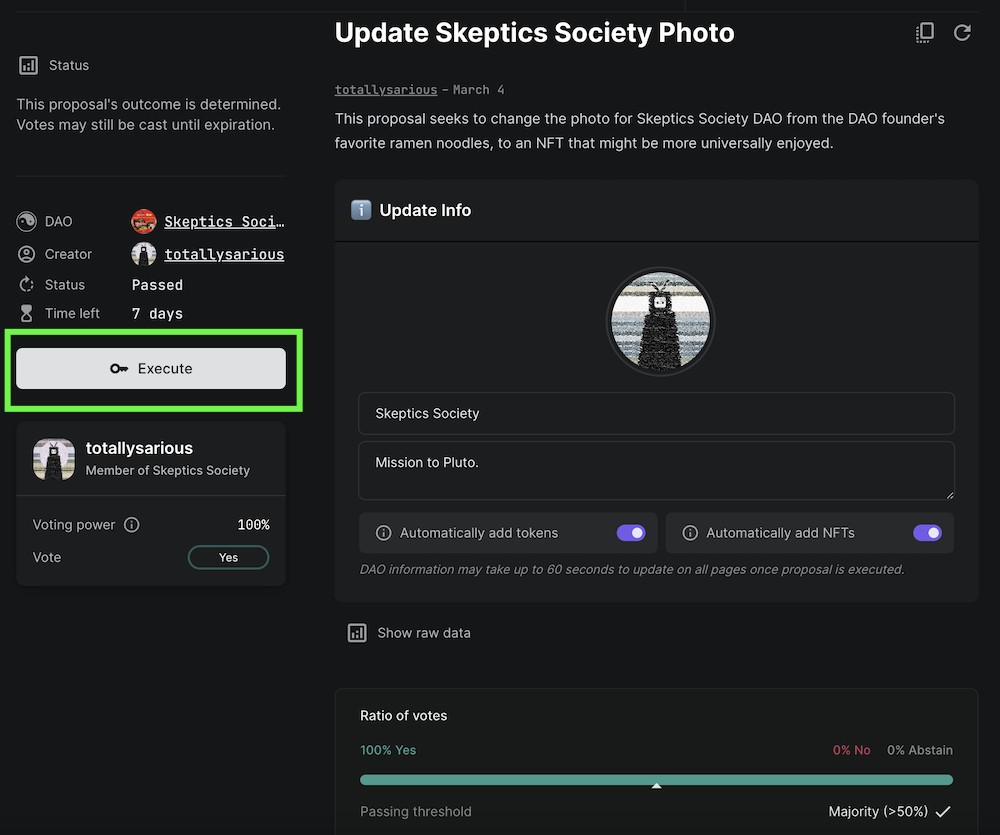

# Update appearance

Once your DAO has been created, any changes to its image, name, or description will need to be done through a proposal and vote.

Check out our YouTube channel for video guides for changing DAO [image](https://youtu.be/TiE0-fQaUVg), [name](https://youtu.be/LJbzUymmVmI), or [description](https://youtu.be/hfuaIGqYBJA)

## 1. Create Proposal

a. From your DAO page, example circled in green, click the Proposal tab, indicated by the yellow arrow.

b. Create a new proposal by clicking the +Proposal button.

c. Give your proposal a title and description.


Voting parameters, shown at the bottom of the above photo, are set at DAO creation and would need a separate proposal to be changed.


d. From the Action Library, select the Appearance tab and click on Update Info.

e. This will populate the below tab, where you can select/upload a new image to use for your DAO, change your DAO name, or description.

f. At the bottom of the screen will be an option to publish your proposal. Once you have reviewed your changes, publish your proposal to start the vote!

## 2. Vote

a. Once the proposal is live, you and other DAO members can vote. If the majority of votes have been cast and the outcome of the vote is decided, the vote can be ended early via the execute button found on the proposal's page.

b. If the DAO membership votes in favor of the appearance change, the change will happen automatically at the close of the voting period.
