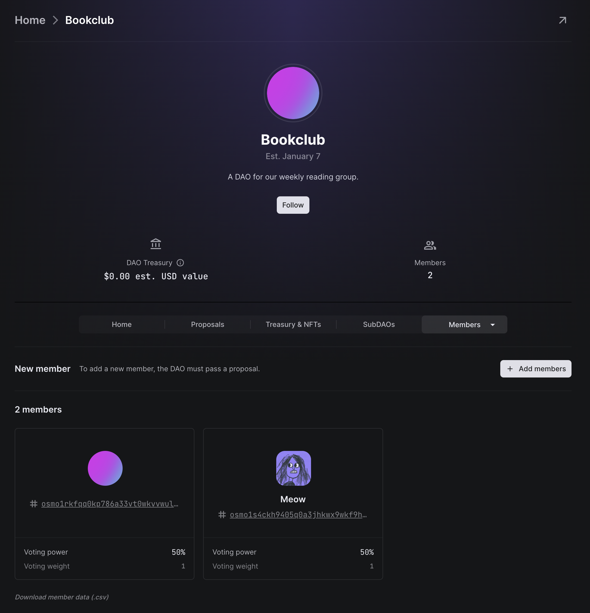

# Joining and leaving a member-based DAO

As explained in [_What's a DAO?_](../../../introduction/whats-a-dao.md#members-multisig-replacement), member-based DAOs have static membership, meaning the DAO must pass a proposal to add or remove members. Members cannot independently decide to join or leave a member-based DAO.

You may want to read the [proposal explanation doc](../../../dao-governance/proposals/what.md) to understand how proposals work in DAOs before proceeding.

## Joining (adding)

To add a new member to a member-based DAO, an existing member must submit a proposal to do so. To begin, starting from your DAO's page, navigate to **Proposals > New Proposal**.

Enter the details of your new proposal, and then click the `Add an action` button.

In the action category selection modal, select the `DAO Governance` category.

Then, choose the `Manage Members` action.

From here, you can add new members, update existing members' voting powers, and remove existing members. In this example, we'll just add a new member.


**Voting weight**\
For Meow's voting weight, we can choose any whole number greater than zero. Since the DAO was created with a single member with a voting weight of 1, we will choose 1 for Meow so that the members have equal voting power. If we instead gave Meow a voting weight of 3, they would have 75% of the DAO's total voting power, and the current member would only have 25%.


All that's left to do is publish, vote on, and then execute the proposal.

Once passed, executing the proposal will activate the software instructions contained in the proposal, which in this case adds Meow to the DAO.

Now that it has been executed, Meow is in the DAO!

## Leaving (removing)

To remove a member from a member-based DAO, the process is identical to adding a new member. However, instead of adding an address under the `Members to add/update` heading, we will add an address under the `Members to remove` heading.

Passing and executing this proposal will kick Meow out of the DAO, and they will no longer be able to vote on future proposals.


If a proposal was created when Meow was a member of the DAO, they will still be able to vote on it. Membership changes only take effect for future proposals.

