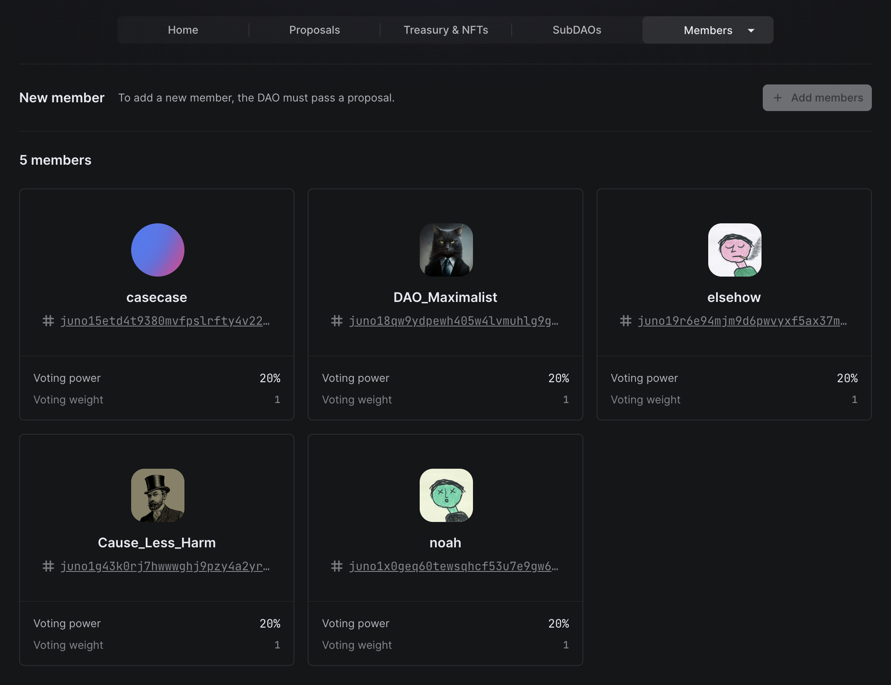
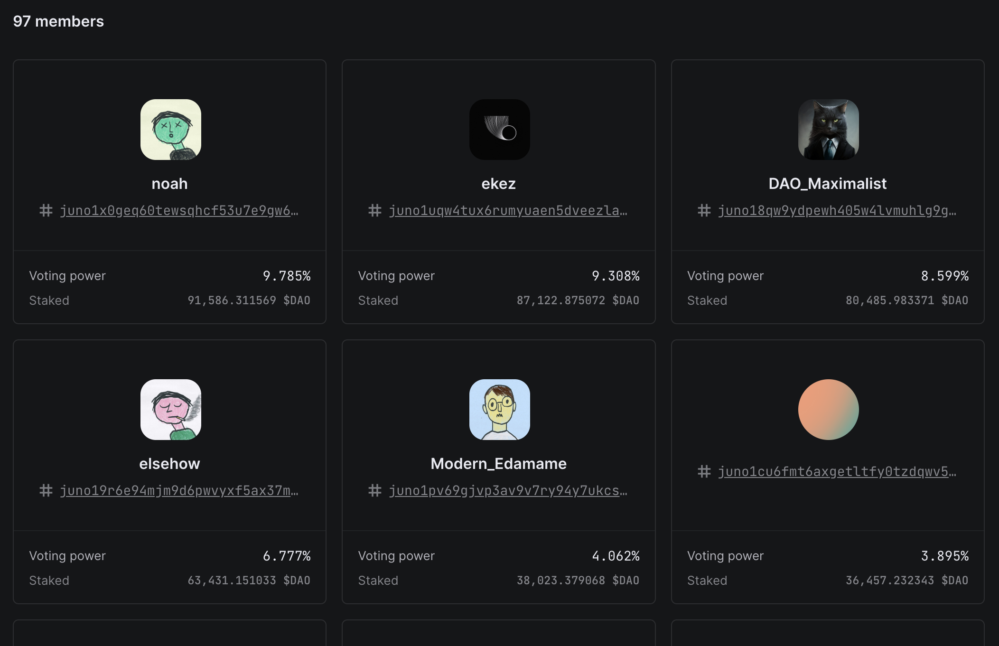

# What's a DAO?

Decentralized Autonomous Organizations (DAOs) are collectively owned governance systems whose governing software is cryptographically bound to obey the wishes of its members.

## Proposals

At its simplest, a DAO performs actions through a proposal process. Members submit proposals to the DAO, which are then voted on by all members. These proposals—their content, votes, and outcomes—are written to an immutable, public ledger (e.g. a blockchain). Proposals can contain natural language (e.g. laws, declarations, etc.), or they can contain software instructions (we call these Actions in the DAO DAO UI). Thus DAOs can be used to govern anything from a low-level software protocol to an entire legislature or government.

When a proposal is passed and executed by the members of the DAO, it becomes canonical. Any actions within the proposal are executed on the blockchain and take immediate effect. For example, once a proposal to pay someone's salary is passed and executed, the salary is paid.


**Real examples**

[This proposal](https://daodao.zone/dao/juno10h0hc64jv006rr8qy0zhlu4jsxct8qwa0vtaleayh0ujz0zynf2s2r7v8q/proposals/A6) in the DAO DAO DAO has a single action associated with it. Only because it was passed and executed did it take effect. This action was responsible for upgrading the DAO to v2.1 of the smart contracts, which brought new features. Conversely, [this other proposal](https://daodao.zone/dao/juno10h0hc64jv006rr8qy0zhlu4jsxct8qwa0vtaleayh0ujz0zynf2s2r7v8q/proposals/A1) contained no actions and served only to ratify the constitution of the DAO.


The DAO governance process can itself be modified through proposals. For example, voting rules like the voting period length, or what proportion of members need to vote yes to pass, can be modified by governance proposals.

You can think of DAOs as a big game of [Nomic](https://en.wikipedia.org/wiki/Nomic). For example, [this proposal](https://daodao.zone/dao/juno1czh5dy2kxwwt5hlw6rr2q25clj96sheftsdccswg9qe34m3wzgdswmw8ju/proposals/A9) in Dog Dao updates the DAOs' voting rules to shorten the voting duration and, thus, make proposals complete more quickly.

## Voting power

Because DAOs are programmable, there are infinite mechanisms one could create to determine a member's voting power. We have created three options that cover the most common use cases of today:

### Members (multisig replacement)

We call the simplest form of DAO a member-based DAO. This type of DAO has _static membership_, meaning that the DAO must pass a proposal to change its members. Adding a new member, removing an existing member, and changing the voting powers of existing members all must be voted on by existing members through a proposal. In other words, no individual has the power to change the membership of the DAO.

This is the DAO structure that replaces the [multisig](https://www.coindesk.com/learn/what-is-a-multisig-wallet). Multisigs can be seen as an early form of a DAO since they solve some of the same issues. Both offer the ability to require multiple people to approve an action, thus allowing a group of people to manage assets and make decisions together.

### Tokens

Some DAOs prefer a more fluid approach to membership, where members can join and leave the DAO at-will. These DAOs use _governance tokens_ to determine voting power such that anyone who owns (and stakes) tokens can submit proposals and vote. These tokens are fungible and may be considered cryptocurrencies if traded on a market.

Governance tokens are by default freely transferrable, meaning any token holder can send any amount of their tokens to someone else (thereby changing the membership of the DAO).


**Tokens are programmable**

Through smart contracts on the blockchain, token behavior can be programmed. Tokens, and thus voting power, can slowly unlock (i.e. vest) over time, or be entirely frozen such that members cannot transfer to anyone else. Anything is possible.


In some ways, governance tokens are analogous to shares in a corporation.However, their programmability allows them to become something entirely new.


**Hot take**

Most DAOs do _not_ need a token. The blockchain ecosystem is token-heavy due to the role cryptocurrencies have played in the blockchain narrative.

Tokens can bring undesirable attention, speculation, and financial expectations, which may distract from the DAO's purpose. If you do use a token, make sure you know why and who can acquire it.

We encourage you to think deeply about whether or not the tradeoffs are worth it, especially because you can always start as a member-based DAO and then switch to being token-based later.


In DAO DAO, tokens must be "staked" in order to be counted as voting power, which is analogous to registering to vote. Staked tokens are non-transferrable. When you want to access your tokens again (in order to transfer or use them elsewhere), you must unstake them first.

Most DAOs have unstaking durations configured, meaning there is a minimum amount of time you must wait after unstaking your tokens before they are available to you. During the unstaking period, the tokens do not count towards your voting power, and you cannot transfer them. This adds a time cost to staking and ensures a greater level of participatory commitment from a DAO's members.

### NFTs

[Non-fungible tokens (NFTs)](https://en.wikipedia.org/wiki/Non-fungible_token) are the non-fungible versions of tokens described above. DAOs that use NFTs to determine voting power operate in the same way as token-based DAOs.
