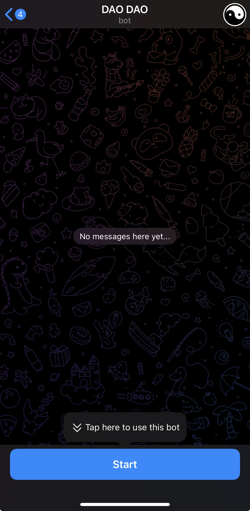
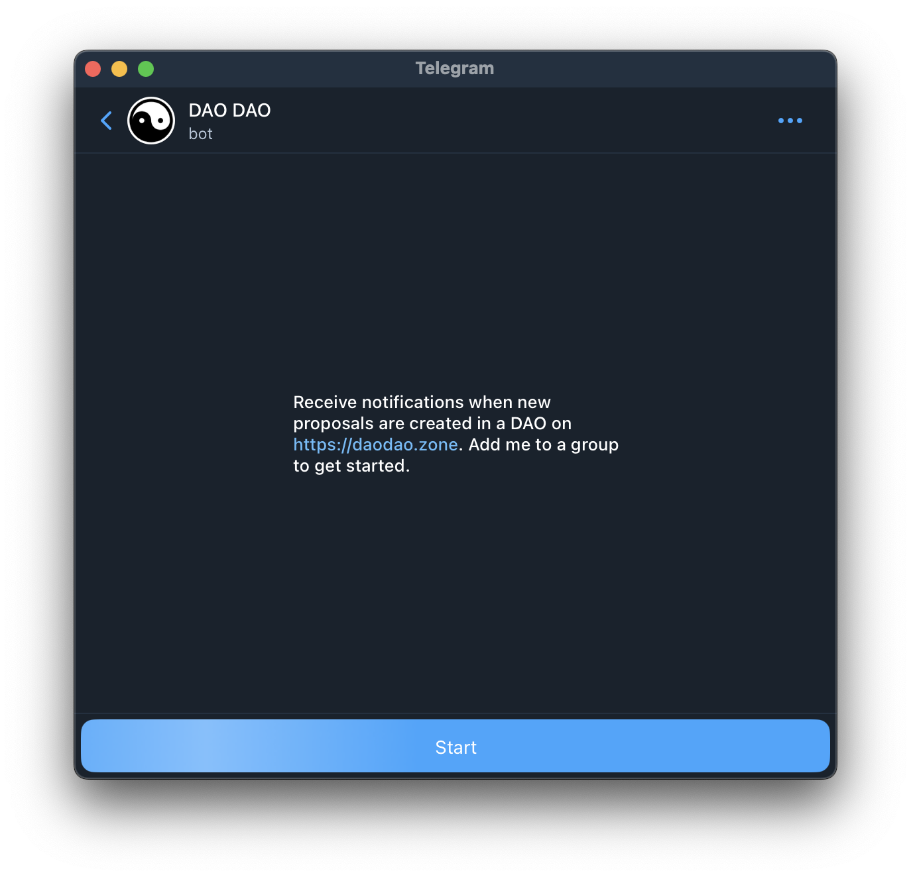
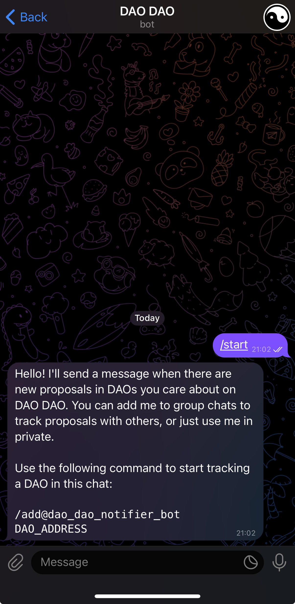
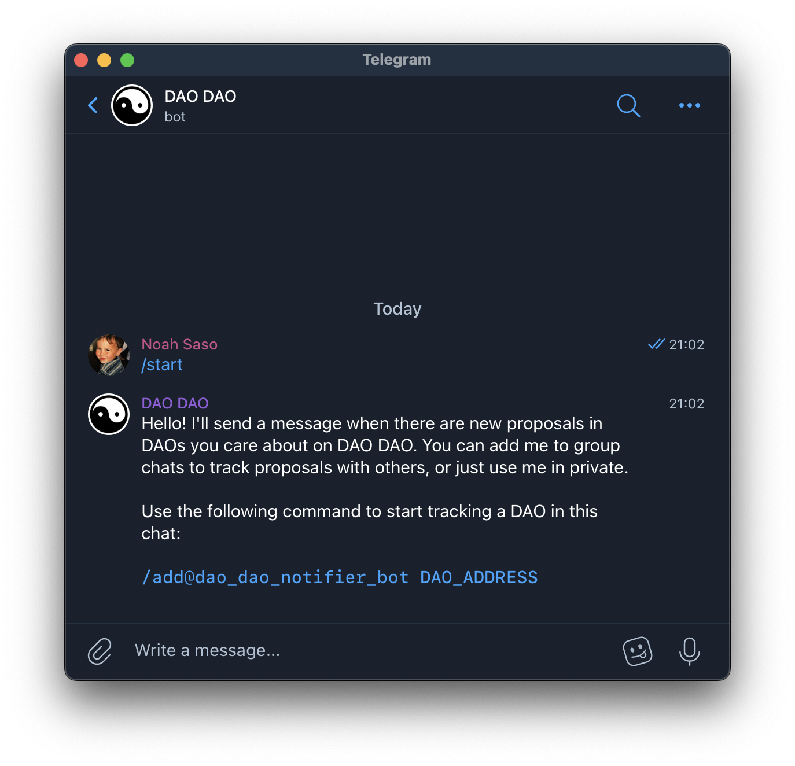
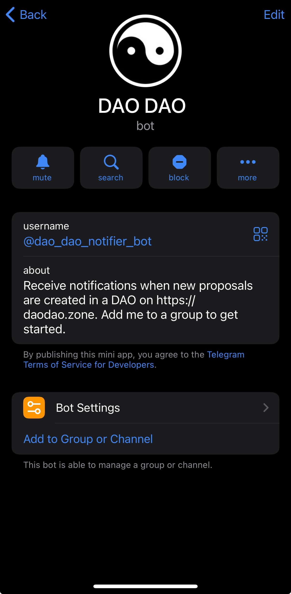
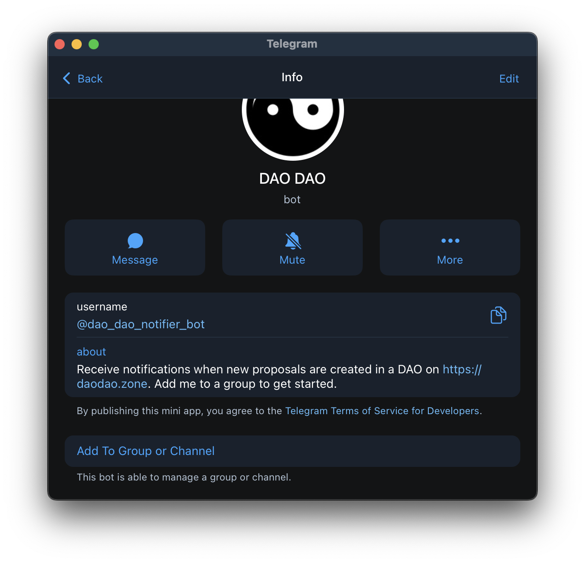
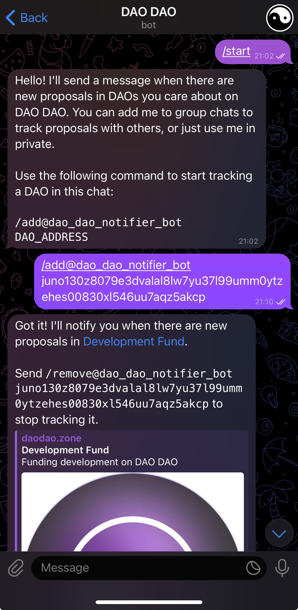
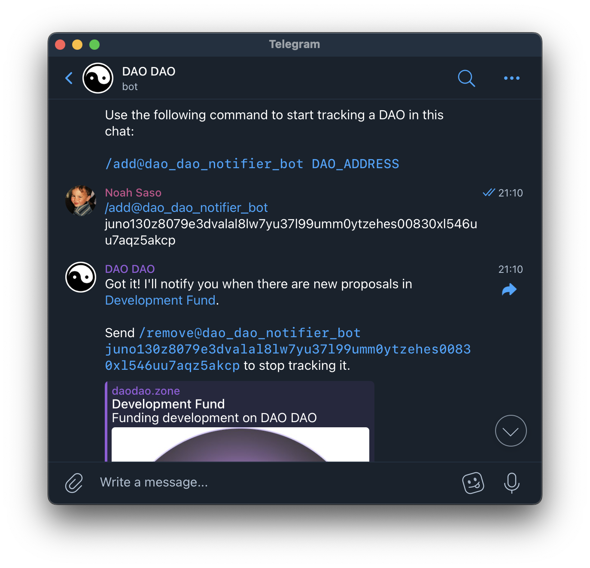

# Telegram Notifications

Setting up Telegram notifications takes 60 seconds.

1.  Start by navigating to https://t.me/dao\_dao\_notifier\_bot and tapping the`Start` button at the bottom.

    \
    On Mobile:

    <div data-full-width="false"></div>

    On Desktop:

    
2.  Once you tap the `Start` button, you should see instructions for tracking a\
    DAO.

    \
    On Mobile:

    

    On Desktop:

    
3.  If you'd like to track DAOs with other people, add the bot to a group chat by tapping its name at the top of the screen and then tapping the `Add to Group or Channel` button at the bottom. When adding the bot to a group, it may ask if you want to make it an admin. You do _**NOT**_ need to do this. Adding it as a regular member is sufficient. Also, it runs in privacy mode, so it can't read any of your\
    messages. If you just want private notifications, skip this step.

    \
    On Mobile:

    

    On Desktop:

    
4.  Once the bot is in the chat where you want to receive notifications, just send the command shown in the instructions to start tracking a DAO. You can also paste the entire DAO URL from your browser instead of typing the address manually.

    ```
    /add@dao_dao_notifier_bot DAO_ADDRESS
    ```

    \
    On Mobile:

    

    On Desktop:

    
5. Now you're done! When new proposals are created, the bot will message you\
   right away. If you added the bot to a group, everyone in the group will start receiving\
   notifications. If you added the bot to a private chat, you'll be the only one receiving\
   notifications. You can track additional DAOs by sending the same command from any chat that\
   the bot is in.
