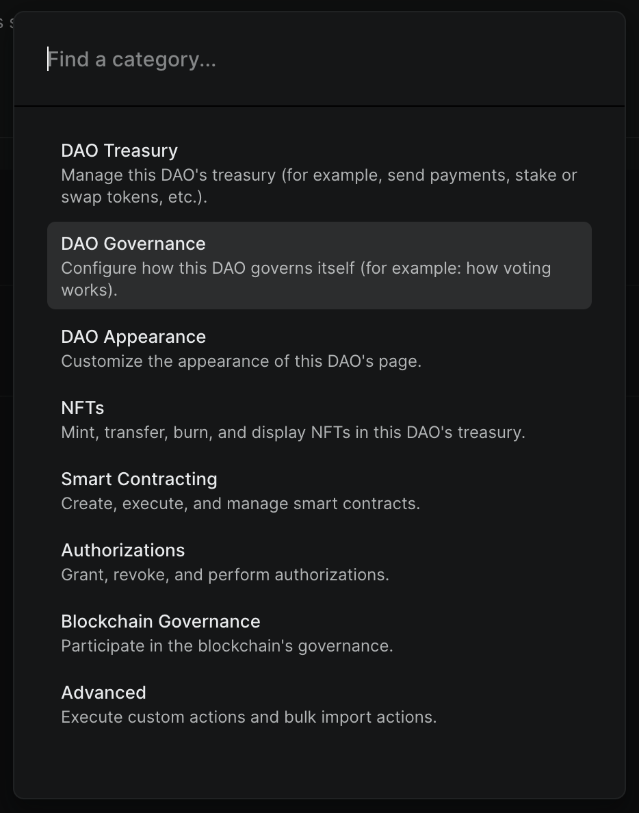
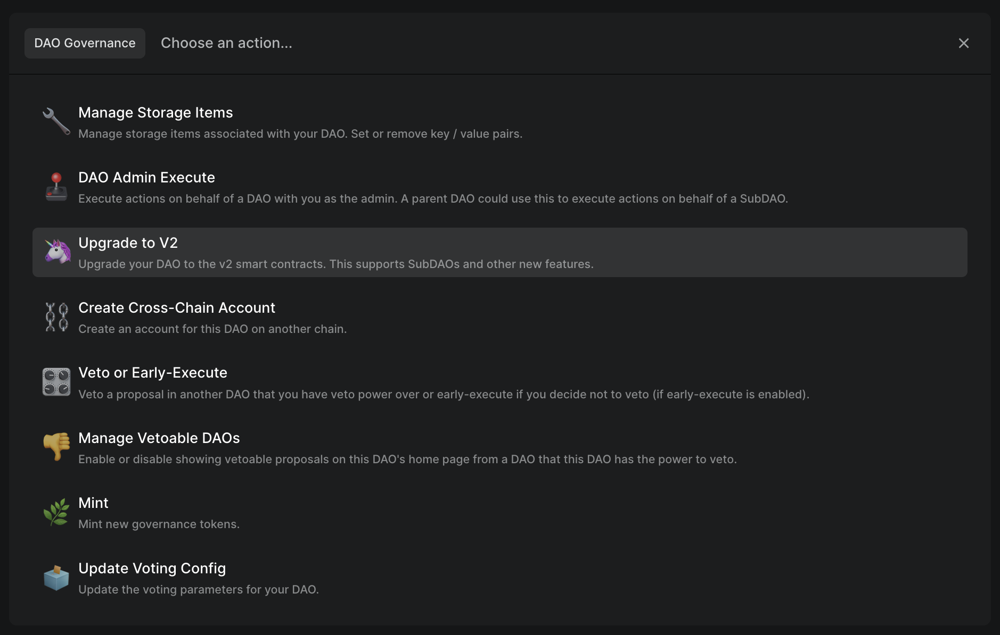
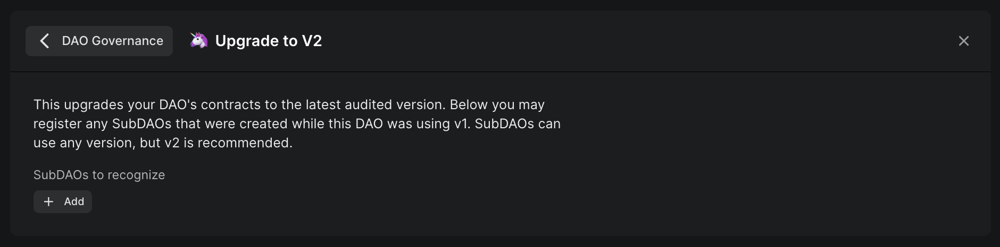

# V1 -> V2

To upgrade a V1 DAO (or multisig) to a V2 DAO, you just need to pass and execute a proposal with the `Upgrade to V2` action.

First, create a new proposal.

Add the `Upgrade to V2` action under the `DAO Governance` category.

If you created any SubDAOs while on V1, you can optionally choose to officially recognize them as SubDAOs (which will show up on the DAO's page).

Once you submit, pass, and execute this proposal, your DAO will be upgraded to V2!

## Why upgrade

By upgrading from V1 to V2, you'll receive new feature releases from DAO DAO and use the latest audited smart contracts.
