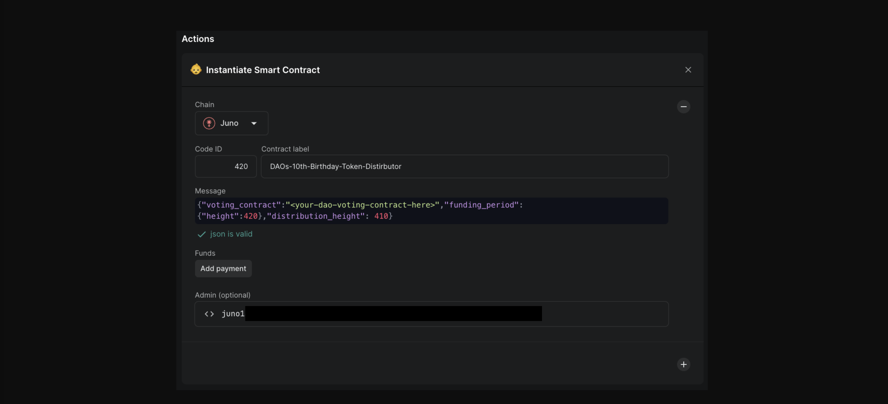
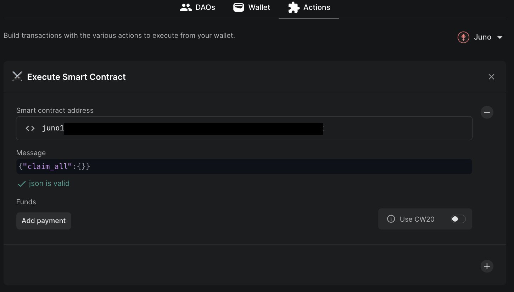

# Distribution to DAO Members

## A. Rewards Distributor
A DAO may want to emit rewards to stakers or its members automatically during predefined intervals. This can happen with the use of the [rewards distributor](https://github.com/DA0-DA0/dao-contracts/blob/development/contracts/distribution/dao-rewards-distributor/README.md), configured to reflect distribution accurately in response to voting power changes.

### Workflow 

### 1. Create Contract 
To create a new rewards distributor, the DAO is set as the contract owner to propose admin-level features.

### 2. Register Reward Denom
To register the token to be sent to DAO members, provide the DAOs `voting_power` module address, a cw20 or native token `denom` to be provided, along with the `emission_rate` defined by an `amount` and `duration` between distribution intervals *(e.g. 0.5udenom per hour)*. 

#### Hook Caller
Also, an optional `hook_caller` can be provided that is allowed to call voting power change hooks.  Often, as in `dao-voting-token-staked` and `dao-voting-cw721-staked` the `vp_contract` calls hooks for power change events, but sometimes they are separate. For example, the `cw4-group` contract is separate from the `dao-voting-cw4` contract and since the `cw4-group` contract fires the membership change events, it's address would be used as the `hook_caller`.

### 3. Fund Contract
:::warning
Be sure to fund the contract by calling the `Fund` entry point, unless your deposit of funds will not be recognized and they will be frozen inside the contract. 
:::

### 4. Claim As DAO Member
To claim any available rewards, a DAO member can simply call the distribution contracts `Claim` entry point. If there are no rewards available, the contract will error. Otherwise, there is no limit to calling this entry point during the distributions claimable timeframe.

### 5. Shutdown 
A distribution can be shut down by an admin. This withdraws all future staking rewards
back to the treasury. Members can claim whatever they earned until this point.
<!-- 
Bulk TX Workflow:
- init2 
- fund contract
-->

## B. Fund Distributor 

Sending tokens to current DAO members is made simple with use of the [cw-fund-distributor contract](https://github.com/DA0-DA0/dao-contracts/tree/development/contracts/distribution/cw-fund-distributor).

### Workflow 

### 1. Create & Fund Contract 

A smart contract instantiate proposal can create the fund distributor by defining:
    - `distribution_height` - the height used for snapshotting voting power.
    - `funding_period` - a time duration that should suffice to move the funds to be distributed into the distributor contract. 
    - `voting_contract` - the DAOs voting contract for calculating distribution ratios

There are two contract entry points to fund a distribution: 
- `FundNative` for native tokens 
- `Recieve` for cw20 tokens.

### 2. DAO Members Claim Tokens

After the `funding_period` expires, the funds held by distributor contract become available for claims. Funding the contract is no longer possible at this point.

There are three contract entry points for choosing how to claim tokens: 
- `ClaimNative` 
- `ClaimCw20` 
- `ClaimAll`

A DAO member can use the accounts builder component to claim their distribution :

### 3. Fund Redistribution 
Considering it is more than likely that not every user would claim its allocation, it is possible to redistribute the unclaimed funds. 

The redistribution method finds all the claims that have been performed and subtracts the amounts from the initially funded balance. The respective allocation ratios for each DAO member remain the same; any previous claims are cleared.

Only the `cw_admin` can call the method.

<!-- 
Bulk TX Workflow:
- init2 
- fund contract
-->

## C. Royalty Splits

### Workflow
